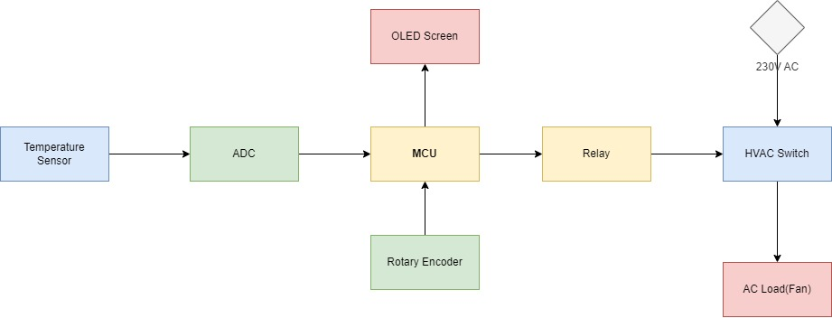

SilvaBack Digital Thermostat
---
## Features
1. Set temperature according to your personal preferences
2. Lock temperature once set it cannot be reset by another person
3. Auto-start to automatically start the thermostat incase the user forgets to turn it on
4. Remote control - control the thermostat using your smartphone

# Tech stack
## Software
1. ESP-IDF
2. MQTT
3. PlatformIO

## Hardware
1. ESP32 DOIT DEVKIT
2. NTC Thermistor
3. HVAC Switch
4. Rotary encoder
5. SSD1306 OLED screen
6. Battery powered - may change
7. KICAD - preferably

# Block diagram

# References
1. [ESP-IDF Programming Guide](https://docs.espressif.com/projects/esp-idf/en/v4.2/esp32/index.html)
